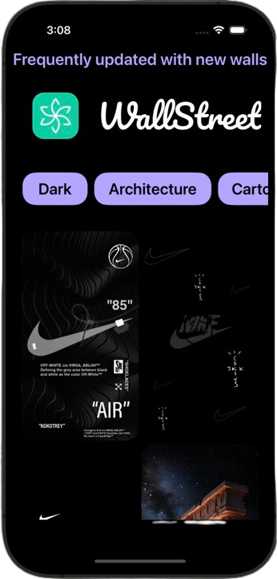
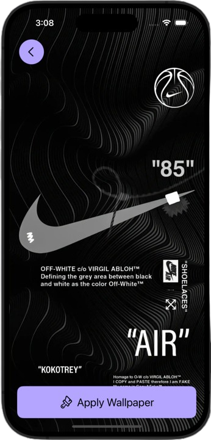

# WallstreetApp

WallStreet is a sleek and simple wallpaper app designed exclusively for iPhone. Built with SwiftUI and native iOS components, it delivers a smooth and aesthetic experience for browsing and applying high-quality wallpapers.

📱 **Also available on Android**  
🔗 [Play Store Link](https://lnkd.in/gMepCg9v)

---

## ✨ Features

- 🎨 **Curated Wallpapers** – A growing collection of beautiful, high-resolution wallpapers.
- 🔎 **Smooth Browsing** – Scroll and explore effortlessly through modern UI.
- ❤️ **Favorites** – Mark wallpapers you love and revisit them easily.
- 📥 **Easy Save** – Save wallpapers to your Photos in one tap.
- 🌙 **Dark Mode Support** – Seamlessly adapts to system appearance.

---

## 🛠️ Tech Stack

- **Language**: Swift
- **Framework**: SwiftUI
- **Platform**: iOS 15+ (iPhone only)
- **Architecture**: MVVM

---

## 🧪 Screenshots

| Home View | Wallpaper View 
|-----------|----------------|
|  |  |

> Add your actual app screenshots in the `assets/` folder and update the links.

---

## 🚀 Getting Started

### Requirements

- macOS with **Xcode 14** or newer
- iPhone running **iOS 15** or later
- Swift Package Manager (SPM) for any dependencies

### Installation

1. Clone the repository:
   ```bash
   git clone https://github.com/vanshsharma5503/WallstreetApp.git
   cd WallstreetApp
